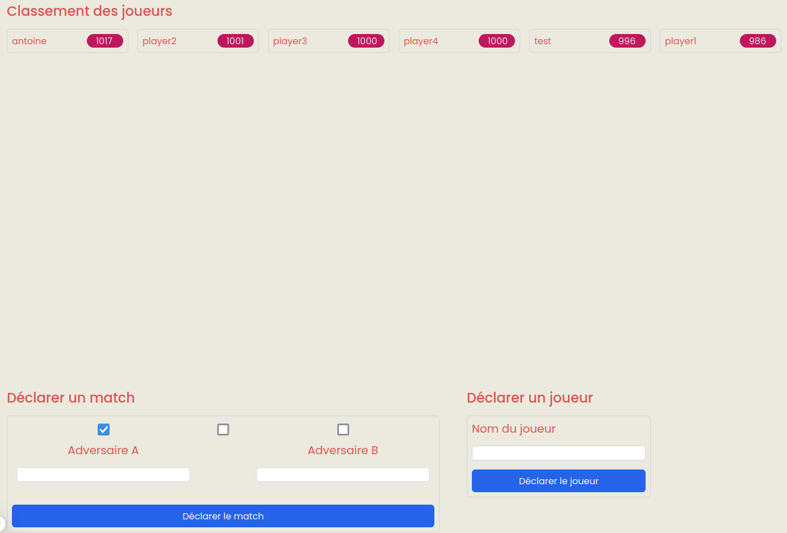
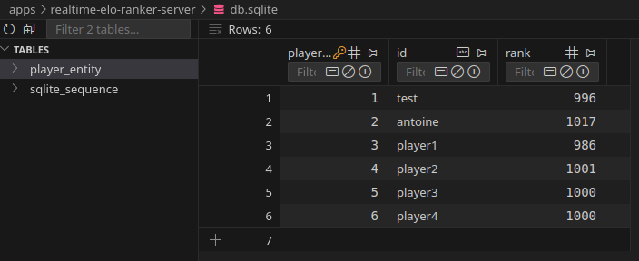
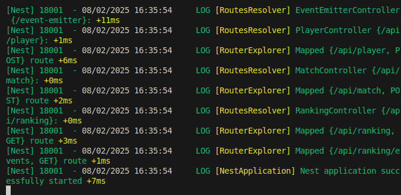
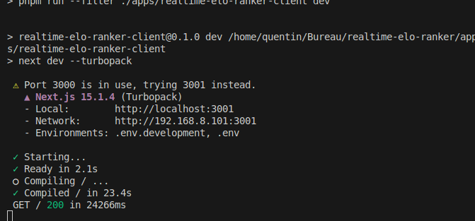
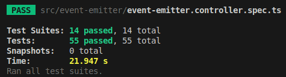
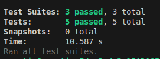
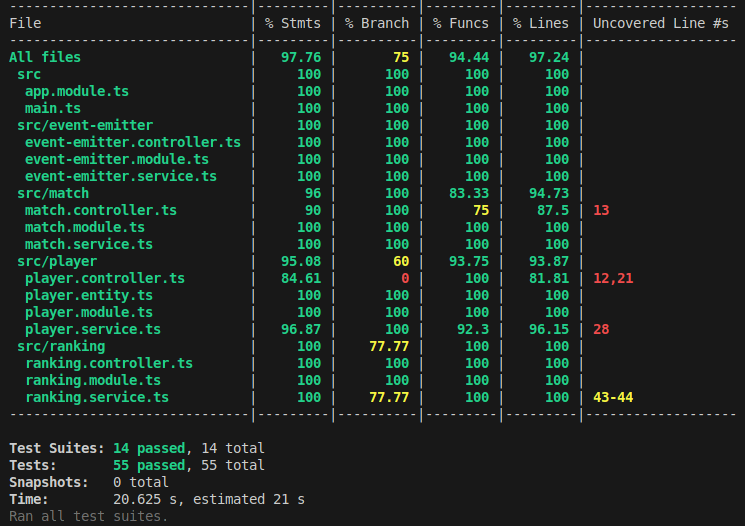
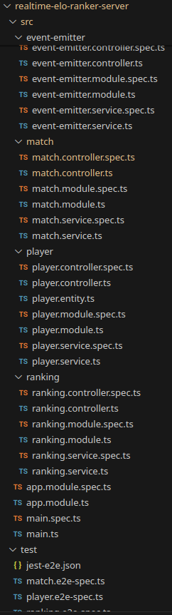

# Realtime Elo Ranker

Realtime Elo Ranker est une application web permettant de simuler des matchs entre des joueurs et de calculer et afficher leur classement Elo en temps réel.

## Développeur

- Nom : BOURREAU
- Prénom : Quentin
- GitHub : [GitHub](https://github.com/BOURREAUQuentin)

Lien du projet sur mon GitHub : [lien projet](https://github.com/BOURREAUQuentin/realtime-elo-ranker)

## Installation du projet

Placez-vous à la racine du projet et suivez ces installations :

1. Suppression des dépendances

```bash
rm -rf node_modules pnpm-lock.yaml
```

2. Installation de NVM

```bash
curl -o- https://raw.githubusercontent.com/nvm-sh/nvm/v0.40.1/install.sh | bash
```

3. Installation de NodeJS

```bash
nvm install 22
nvm use 22
nvm alias default 22
```

4. Installation du gestionnaire de dépendances alternatif (PNPM)

```bash
corepack enable pnpm
corepack use pnpm@8
```

5. Installation pour l'EventEmitter

```bash
npm install eventemitter2
npm install @nestjs/event-emitter@^3.0.0
```

6. Installation pour la gestion de la base de données (TypeORM et SQLite)

```bash
npm install @nestjs/typeorm@^11.0.0 sqlite3@^5.1.7 typeorm@^0.3.20
```

7. Installation pour les tests

```bash
npm install --save-dev @nestjs/testing jest @types/jest ts-jest
pnpm add -D jest supertest
```

## Problèmes de lancement

### Problème de KeyId

Si vous rencontrez un problème de KeyId : **Error: Cannot find matching keyid**, vous avez uniquement à saisir cette commande dans le terminal pour mettre à jour Corepack :

```babash
corepack --activate prepare
```

### Problème de dépendances

Si vous rencontrez un quelconque problème de dépendance **ERROR [ExceptionHandler] UnknownDependenciesException**, ce qui ne devrait pas arriver si vous avez suivi l'installation, ma seule solution était de tout désinstaller et réininstaller par la suite (soit refaire la partie **Installation du projet**).

## Lancement du projet

Pour lancer le projet, il vous suffit de se placer dans la racine du projet. Ensuite, j'ai créé des alias pour lancer plus facilement des commandes dans le projet :

**Lancement de la source CSS exposée par la librairie `libs/ui`**
```bash
pnpm run libs:ui:build
```

**Lancement du serveur**
```bash
pnpm apps:server:dev
```

**Lancement du client** (une fois le serveur lancé seulement)
```bash
pnpm apps:client:dev
```
Le client sera accessible à l'adresse `http://localhost:3001`.

**Lancement de la documentation Swagger** (expliquée plus tard dans le README)
```bash
pnpm docs:swagger:start
```
Le serveur Swagger sera accessible à l'adresse `http://localhost:3001/api-docs`.

**Lancement des tests unitaires et d'intégration**
```bash
cd apps/realtime-elo-ranker-server/
pnpm test
```

**Lancement des tests E2E**
```bash
cd apps/realtime-elo-ranker-server/
pnpm test:e2e
```

**Lancement du coverage des tests unitaires et d'intégration**
```bash
cd apps/realtime-elo-ranker-server/
pnpm test:cov
```

## Les fonctionnalités que j'ai implémentées

### L'architecture choisie

J'ai choisi de suivre une architecture modulaire basée sur le pattern MVC (Model-View-Controller), organisée par domaines fonctionnels. Chaque module représente une fonctionnalité distincte de l'application.

#### Structure des Modules

L'application est divisée en plusieurs modules fonctionnels :
- `event-emitter` : Gestion des événements
- `match` : Gestion des parties
- `player` : Gestion des joueurs
- `ranking` : Gestion des classements

#### Organisation de chaque Module
Chaque module suit une structure similaire :
- `*.controller.ts` : Gère les requêtes HTTP et définit les endpoints de l'API
- `*.service.ts` : Contient la logique métier
- `*.module.ts` : Configure le module et ses dépendances
- `*.spec.ts` : Contient les tests unitaires

#### Module Principal (app.module.ts)
Le fichier `app.module.ts` agit comme point d'entrée de l'application. Il importe et configure tous les modules fonctionnels, permettant leur utilisation dans l'application.

#### Avantages de cette Architecture
- **Séparation des Responsabilités** : Chaque composant a un rôle précis
- **Modulaire** : Facilite la maintenance et l'évolution du code
- **Testable** : Structure optimisée pour les tests unitaires
- **Scalable** : Permet d'ajouter facilement de nouvelles fonctionnalités

#### Installation de l'architecture

Pour réaliser cette architecture, j'ai simplement utilisé les commandes de NestJS par défaut :

1. Création des Services
```bash
pnpm nest generate service event-emitter
pnpm nest generate service match
pnpm nest generate service player
pnpm nest generate service ranking
```

2. Création des Controllers
```bash
pnpm nest generate controller event-emitter
pnpm nest generate controller match
pnpm nest generate controller player
pnpm nest generate controller ranking
```

3. Création des Modules
```bash
pnpm nest generate module event-emitter
pnpm nest generate module match
pnpm nest generate module player
pnpm nest generate module ranking
```

### Les routes

J'ai réalisé toutes les routes demandées par la documentation Swagger en gérant bien évidemment chaque cas d'erreur de retour suivant la documentation. La documentation Swagger sert à générer automatiquement une interface interactive pour tester, comprendre et interagir facilement avec une API, en fournissant des informations détaillées sur les endpoints, les paramètres et les réponses attendues.

#### 1. **/api/match (POST)** - Publication des résultats d'un match
- **Description** : Permet de publier les résultats d'un match et de mettre à jour le classement des joueurs.
- **Paramètres** :
  - `winner` (string) : Identifiant du gagnant.
  - `loser` (string) : Identifiant du perdant.
  - `draw` (boolean) : Indique si le match est un match nul.
- **Réponses** :
  - **200** : Résultats publiés avec succès.
    ```json
    {
      "winner": { "id": "player1", "rank": 1 },
      "loser": { "id": "player2", "rank": 2 }
    }
    ```
  - **422** : Erreur si l'un des joueurs n'existe pas.
    ```json
    {
      "code": 422,
      "message": "Soit le gagnant, soit le perdant indiqué n'existe pas"
    }
    ```

Le calcul du nouvel ELO des deux joueurs se fait suivant les explications du README du sujet.

#### 2. **/api/player (POST)** - Création d'un joueur
- **Description** : Permet de créer un nouveau joueur dans le système.
- **Paramètre** :
  - `id` (string) : Identifiant unique du joueur.
- **Réponses** :
  - **200** : Joueur créé avec succès.
    ```json
    {
      "id": "player1",
      "rank": 1
    }
    ```
  - **400** : L'identifiant du joueur n'est pas valide.
    ```json
    {
      "code": 400,
      "message": "L'identifiant du joueur n'est pas valide"
    }
    ```
  - **409** : Le joueur existe déjà.
    ```json
    {
      "code": 409,
      "message": "Le joueur existe déjà"
    }
    ```

Le calcul de l'ELO du nouveau joueur se fait suivant le README du sujet.

#### 3. **/api/ranking (GET)** - Récupération du classement
- **Description** : Permet de récupérer le classement des joueurs actuels.
- **Réponse** :
  - **200** : Classement récupéré avec succès.
    ```json
    [
      { "id": "player1", "rank": 1 },
      { "id": "player2", "rank": 2 }
    ]
    ```
  - **404** : Aucun joueur dans le classement.
    ```json
    {
      "code": 404,
      "message": "Le classement n'est pas disponible car aucun joueur n'existe"
    }
    ```

#### 4. **/api/ranking/events (GET)** - Abonnement aux mises à jour du classement
- **Description** : Permet de s'abonner aux mises à jour du classement en temps réel. Les mises à jour sont envoyées sous forme de flux de données texte.
- **Réponse** :
  - **200** : Abonnement réussi et mise à jour du classement envoyée.
    ```json
    {
      "type": "RankingUpdate",
      "player": { "id": "player1", "rank": 1 }
    }
    ```
  - **Erreur** : En cas d'erreur, un objet `Error` est envoyé et le flux est interrompu.
    ```json
    {
      "type": "Error",
      "code": 500,
      "message": "Erreur serveur"
    }
    ```

#### Gestion des erreurs
Toutes les routes incluent une gestion complète des erreurs, avec des codes d'erreur HTTP appropriés et des messages détaillés. Si une erreur se produit, un objet `Error` est renvoyé avec les détails comme demandé suivant la documentation Swagger.

### L'EventEmitter

J'ai réalisé l'EventEmitter pour gérer l'envoi en temps réel des mises à jour du classement via la route `/api/ranking/events`. Lorsqu'un événement de mise à jour du classement est émis, les clients abonnés reçoivent des notifications en temps réel sous forme de flux de données texte. J'ai choisi de créer un module

#### Structure de l'EventEmitter

J'ai choisi une structure générique. L'intérêt de créer un dossier `event-emitter` séparé est de centraliser la gestion des événements à travers l'application, ce qui permet de garder un code propre et modulaire. En centralisant la logique d'émission d'événements dans un seul service (EventEmitterService), je peux émettre des événements de manière générique depuis n'importe quel composant de l'application. Par exemple, pour émettre un événement de mise à jour du classement d'un joueur, il suffit simplement d'utiliser l'instance de l'eventEmitter `eventEmitter.emit('ranking.update', player)` où que ce soit dans l'application, sans avoir à se soucier des détails de l'implémentation sous-jacente en important simplement l'eventEmitter.

#### EventEmitterService

Le service `EventEmitterService` encapsule la logique d'émission des événements. Voici comment il est structuré :

```typescript
import { Injectable } from '@nestjs/common';
import { EventEmitter2 } from 'eventemitter2';

@Injectable()
export class EventEmitterService {
  private eventEmitter: EventEmitter2;

  constructor() {
    this.eventEmitter = new EventEmitter2();
  }

  getEmitter(): EventEmitter2 {
    return this.eventEmitter;
  }

  emit(event: string, payload: any): boolean {
    return this.eventEmitter.emit(event, payload);
  }
}
```

- **getEmitter** : Permet d'accéder à l'instance de l'EventEmitter2.
- **emit** : Permet d'émettre un événement avec un payload, par exemple pour notifier les mises à jour du classement.

#### EventEmitterController

Le contrôleur EventEmitterController gère les interactions HTTP liées aux événements. Actuellement, il est défini comme suit :

```typescript
import { Controller } from '@nestjs/common';

@Controller('event-emitter')
export class EventEmitterController {}
```

Il peut être étendu pour inclure des fonctionnalités supplémentaires si nécessaire, mais pour l'instant il n'est que le point d'entrée pour gérer les interactions d'événements.

#### EventEmitterModule

Le module EventEmitterModule est utilisé pour centraliser l'injection du service EventEmitterService dans mon application :

```typescript
import { Module } from '@nestjs/common';
import { EventEmitterService } from './event-emitter.service';

@Module({
  providers: [EventEmitterService],
  exports: [EventEmitterService],
})
export class EventEmitterModule {}
```

#### Abonnement et émission des événements

Le service EventEmitterService est utilisé pour émettre des événements dans la route `/api/ranking/events`. Cela permet d'envoyer des mises à jour en temps réel aux clients abonnés.

Lorsqu'un changement dans le classement survient (par exemple, un match est joué et le classement des joueurs est mis à jour), un événement est émis. Voici un exemple d'émission d'événement pour notifier les mises à jour du classement (winner et loser) :

```typescript
// Exemple d'émission d'un événement dans le service
this.eventEmitterService.emit('RankingUpdate', winner);
```

### La base de données

Dans ce projet, la gestion des données des joueurs est réalisée à la fois en RAM et dans une base de données afin d'optimiser les performances et assurer la persistance des données entre les redémarrages du serveur. Cette approche me permet de répondre aux besoins de performance tout en garantissant que les données sont correctement stockées de manière persistante.

**Pourquoi utiliser les deux ?**

- Stockage en RAM : Pour accélérer l'accès aux données lors des requêtes fréquentes, telles que getPlayer ou getAllPlayers, les joueurs sont stockés en RAM. Cela évite d'effectuer une requête en base de données à chaque fois que ces informations sont demandées, améliorant ainsi la vitesse de réponse du serveur.

- Stockage en base de données : Bien que le stockage en RAM offre une réponse rapide, il est volatil, ce qui signifie que les données seront perdues lorsque je redémarre le serveur. Par conséquent, il est nécessaire de stocker les données dans une base de données pour garantir leur persistance entre les redémarrages du serveur.

**TypeORM pour la persistance**

Pour gérer la persistance des données en base de données, j'utilise TypeORM, un ORM (Object-Relational Mapping) qui permet de manipuler des objets TypeScript/JavaScript pour interagir avec la base de données. TypeORM est configuré pour utiliser SQLite dans ce projet, une base de données légère qui est idéale pour les tests et les environnements de développement.

#### Configuration de TypeORM

Dans le fichier app.module.ts, la configuration suivante me permet de connecter l'application à une base de données SQLite et de gérer les entités avec TypeORM :
```typescript
import { Module } from '@nestjs/common';
import { TypeOrmModule } from '@nestjs/typeorm';
import { PlayerModule } from './player/player.module';
import { MatchModule } from './match/match.module';
import { RankingModule } from './ranking/ranking.module';
import { EventEmitterModule } from './event-emitter/event-emitter.module';

@Module({
  imports: [
    TypeOrmModule.forRoot({
      type: 'sqlite',
      database: 'db.sqlite',
      entities: [__dirname + '/**/*.entity{.ts,.js}'],
      synchronize: true,
    }),
    PlayerModule, 
    MatchModule, 
    RankingModule, 
    EventEmitterModule
  ],
  controllers: [],
  providers: [],
})
export class AppModule {}
```

#### Entité PlayerEntity

L'entité PlayerEntity est utilisée pour représenter les joueurs dans la base de données. Elle définit les colonnes de la table des joueurs et la façon dont les données doivent être stockées en base. Voici un exemple d'entité :
```typescript
import { Entity, PrimaryGeneratedColumn, Column } from 'typeorm';

@Entity()
export class PlayerEntity {
  @PrimaryGeneratedColumn()
  playerId: number; // Identifiant unique du joueur dans la base de données

  @Column()
  id: string; // Identifiant unique du joueur (non généré par la base)

  @Column()
  rank: number; // Classement du joueur
}
```

#### Gestion des données en RAM

Comme expliqué précédemment, en complément de la persistance en base de données, je stocke également les joueurs en RAM pour améliorer les performances lors des requêtes. Lorsqu'un joueur est récupéré ou ajouté, ses données sont mises en cache dans la mémoire vive pour éviter des appels répétitifs à la base de données.

```typescript
@Injectable()
export class PlayerService {
  private players: Player[] = []; // stockage en RAM

  constructor(
    @InjectRepository(PlayerEntity) private readonly playerRepository: Repository<PlayerEntity>,
    private readonly eventEmitterService: EventEmitterService,
  ) {
    this.loadPlayersFromDatabase();
  }

  private loadPlayersFromDatabase() {
    console.log("chargement bd");
    this.playerRepository.find().then((playersFromDb) => {
      this.players = playersFromDb.map((p) => ({ id: p.id, rank: p.rank }));
    }).catch((error) => {
      console.error('Erreur lors du chargement des joueurs depuis la base:', error);
    });
  }

  createPlayer(id: string): Promise<Player | null> {
    if (this.players.some((p) => p.id === id)) {
      return Promise.resolve(null);
    }

    const averageRank =
        this.players.length > 0
            ? this.players.reduce((sum, player) => sum + player.rank, 0) /
              this.players.length
            : 1000;

    const newPlayer: Player = { id, rank: Math.round(averageRank) };
    this.players.push(newPlayer); // maj en mémoire vive (RAM)

    // maj en base de données
    const newPlayerEntity = this.playerRepository.create({
        id: newPlayer.id,
        rank: newPlayer.rank,
    });

    return this.playerRepository.save(newPlayerEntity)
        .then(() => {
            this.eventEmitterService.emit('ranking.update', newPlayer);
            return newPlayer;
        });
  }

  getPlayer(id: string): Player | undefined {
    return this.players.find((p) => p.id === id); // depuis la RAM
  }

  getAllPlayers(): Player[] {
    return [...this.players].sort((a, b) => b.rank - a.rank); // depuis la RAM
  }
}
```

### Les tests

J'ai ajouté des tests qui sont essentiels pour garantir le bon fonctionnement de l'application. Ce projet utilise Jest pour les tests unitaires et d'intégration, en combinaison avec les utilitaires fournis par NestJS pour faciliter la gestion des tests.

#### Tests Unitaires

Mes tests unitaires permettent de tester les petites unités de code indépendamment, généralement en isolant les services ou autres composants.

Structure des tests unitaires et d'intégration : Mes fichiers de tests sont placés à côté des fichiers sources, ce qui permet une organisation claire et modulaire. Par exemple, un fichier `player.service.ts` aura un fichier de test `player.service.spec.ts` à côté de lui.

#### Tests d'Intégration

Mes tests d'intégration permettent de tester plusieurs composants ensemble pour s'assurer qu'ils fonctionnent correctement lorsqu'ils sont intégrés. Avec NestJS, on peut tester les interactions entre les services, les contrôleurs, et la base de données.

Mes tests unitaires et d'intégration se retrouvent dans le même fichier à chaque fois suivant la structure expliquée précédemment et la commande de lancement est expliquée au début de mon README.

#### Tests End-to-End (E2E)

Enfin, j'ai ajouté également des tests End-to-End (E2E) qui simulent un flux complet de l'application, y compris les appels API réels. Cela permet de tester l'ensemble du processus, y compris la gestion des requêtes HTTP, les contrôleurs, et les services.

Structure des tests E2E : Mes fichiers de tests sont placés dans un dossier test au même niveau que `src`.

#### Couverture des tests

Le coverage (couverture) des tests permet d'évaluer quelle proportion du code source est couverte par les tests automatisés. Il permet de s'assurer que les différentes parties de l'application sont bien testées et aide à identifier les zones non couvertes, qui pourraient potentiellement contenir des bugs. J'ai ainsi mis en place un rapport de couverture des tests (commande expliquée au début du README) en obtenant un pourcentage de couverture global du serveur de 97,76%.

## Captures de l'application

**Capture de l'application**



**Capture de la base de données**



**Capture du lancement du serveur**



**Capture du lancement du client**



**Capture du lancement des tests unitaires et d'intégration**



**Capture du lancement des tests E2E**



**Capture du lancement de la couverture des tests**



**Capture de l'architecture du projet**




# 

BOURREAU Quentin - BUT Info 3.1.B